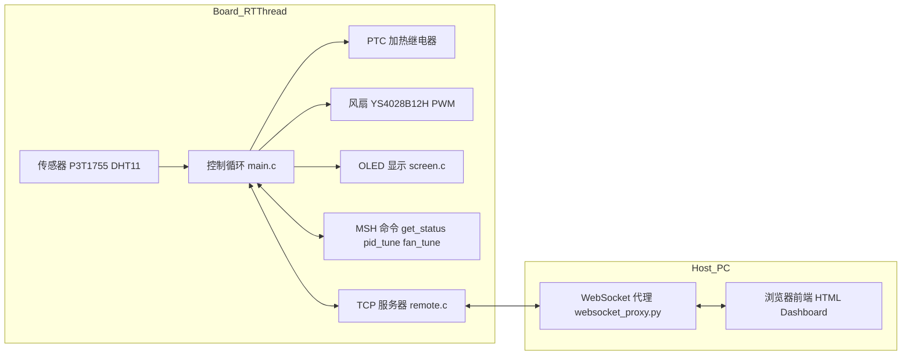

# 基于 RT-Thread 的简单恒温泡沫箱

本项目是一个基于 RT-Thread 和NXP FDRM-MCXA156的简单温控箱系统，集成了：

- PTC 恒温加热 + 风扇冷却的闭环温度控制  
- RT-Thread MSH 调参命令与状态查询接口  
- 通过 TCP 的远程控制协议  
- Python WebSocket 代理  
- 浏览器端可视化仪表盘与历史曲线  

---

## 功能概览

- 恒温控制  
  - 支持目标温度设定，自动在加热 / 保温 / 冷却三种状态间切换  
  - 双路 PTC 加热元件：高温 / 低温 PTC，按目标温度智能选用  
  - 风扇 PWM 调速，结合前馈 + PID 控制实现稳定温度控制

- 传感与显示  
  - 使用板载 P3T1755 作为环境温度传感器  
  - 使用 DHT11 获取箱内温度与湿度  
  - OLED 屏幕实时显示当前控制状态、当前温度、目标温度、环境温度

- 网络与远程控制  
  - 板端启动 TCP 服务器，提供 JSON 状态查询和参数配置接口  
  - Python [`websocket_proxy.py`](applications/remote/websocket_proxy.py:1) 作为 WebSocket 代理，与浏览器前端通讯  
  - Web 前端仪表盘 [`index.html`](applications/HTML/index.html:1) 展示实时温度、控制状态、风扇/加热器状态、PID 诊断信息，并支持在线调参

- 调参与诊断  
  - MSH 命令：  
    - `get_status`：打印当前系统状态与控制参数  
    - `pid_tune`：在线调整 PID 参数  
    - `fan_tune`：在线调整风扇相关参数与预热阈值表  
  - Web 前端提供 PID、风扇参数、预热阈值表的可视化编辑界面

---

## 系统架构与数据流

### 总体架构



### 控制主循环

核心逻辑在 [`main.c`](applications/main.c:178) 中：

- 周期：$SAMPLE\_PERIOD\_MS = 1000$ ms  
- 传感：  
  - `p3t1755_read_temp(&env_temperature)` 读环境温度  
  - DHT11 `temp_dht` / `humi_dht` 读箱内温湿度  
- 状态机：  
  - `CONTROL_STATE_HEATING`  
  - `CONTROL_STATE_WARMING`  
  - `CONTROL_STATE_COOLING`  
  - `CONTROL_STATE_IDLE`  
- PTC 选择逻辑：  
  - 当前温度与目标温度比较，结合 `warming_threshold` 和 `hysteresis_band` 决定：  
    - 进入加热 / 预热 / 冷却  
    - 选择高温 PTC 还是低温 PTC  
- 风扇控制：  
  - 以 `target_temperature` 与 `env_temperature` 计算出前馈风速 `get_feedforward_speed`  
  - 冷却时启用 PID：  
    - PID 输入：当前箱内温度与目标温度误差  
    - PID 输出与前馈叠加，形成 `fan_speed_cmd`  
    - 进行速度限幅以及简单抗积分饱和  
  - 对最终速度 `final_fan_speed` 做一阶滤波，避免 PWM 抖动  

---

## 主要模块说明

### 嵌入式控制核心 [`main.c`](applications/main.c:1)

- 线程：  
  - `working_led()`：工作指示灯闪烁线程  
  - `screen_on()`：OLED 刷新线程（定义在 [`screen.c`](applications/OLED/screen.c:7)）  
  - `remote_start()`：板子端TCP服务器启动线程（定义在 [`remote.c`](applications/remote/remote.c)中）
- 传感器初始化：  
  - P3T1755：`p3t1755_init()`  
  - DHT11：通过 `rt_device_find("temp_dht")` / `"humi_dht"` 打开  
- 加热与风扇：  
  - PTC 控制引脚：`PTC_PIN` / `BTM_PTC_PIN`  
  - 风扇：`ys4028b12h_init()` + `ys4028b12h_set_speed()`  
- 控制参数：  
  - PID：`KP`, `KI`, `KD`  
  - 风扇：`fan_speed_circulation`, `fan_min`, `fan_max`, `fan_smooth_alpha`  
  - 预热阈值表：`warming_ff_table[]` 与 `evaluate_warming_threshold()`  

### 远程 TCP 服务 [`remote.c`](applications/remote/remote.c:34)

- 启动：  
  - 由 `remote_start()` 创建线程 `remote_server_thread_entry`  
  - 服务器监听端口：`SERVER_PORT = 5000`  
- 协议：  
  - 文本命令 + `\r\n` 结束  
  - 支持命令：  
    - `get_status`：返回一行 JSON 状态，字段包括：  
      - `current_temperature`, `target_temperature`, `current_humidity`, `env_temperature`  
      - `ptc_state`, `btm_ptc_state`, `control_state`  
      - `fan_speed`, `fan_speed_percent`, `feedforward_speed`, `pid_output`  
      - PID 参数、积分误差、预热阈值、风扇参数等  
    - `pid_tune ...`：转发到 `pid_tune()` 处理  
    - `fan_tune ...`：转发到 `fan_tune()` 处理  

### OLED 显示 [`screen.c`](applications/OLED/screen.c:7)

- 使用 u8g2 I2C 驱动 SSD1306 128×64 OLED  
- 每秒刷新一次：  
  - 第一行显示当前 `control_state`（HEATING/COOLING/IDLE/WARMING）  
  - 其余行显示当前温度、目标温度、环境温度  

### WebSocket 代理 [`websocket_proxy.py`](applications/remote/websocket_proxy.py:1)

- 与板子 TCP 服务器建立长连接，周期性发送 `get_status` 命令  
- 将返回的 JSON 状态广播给所有 WebSocket 客户端  
- 接收 WebSocket 客户端发来的命令字符串，转发给板子 TCP 服务  
- 默认：  
  - TCP 目标：`TCP_SERVER_IP = "板子的IP"`, 端口 `5000`  
  - WebSocket 监听：`WS_SERVER_IP = "0.0.0.0"`, 端口 `8765`  

### Web 前端仪表盘 [`applications/HTML`](applications/HTML/index.html:1)

- 使用 HTML/CSS/JS + `lightweight-charts` 绘制温度历史 K 线  
- 模块化布局：  
  - 实时温度“温度计”视图，显示：  
    - 当前温度、目标温度  
    - 上下界、预热区间  
  - 实时指标面板：  
    - 传感器读数  
    - PTCT/底部加热状态  
    - 控制状态、预热阈值、迟滞带  
    - 风扇输出、前馈、PID 输出、误差等  
  - 控制面板：  
    - 目标温度输入  
    - PID 参数输入  
    - 风扇参数输入（迟滞带、循环风、最小/最大风速、平滑系数）  
    - 预热阈值表编辑  
  - 历史温度图：  
    - 以 1 分钟为周期的蜡烛图展示 `current_temperature`  

---

## 编译与运行

> 本项目使用RT-Thread Env的scons构建工程，板子选用NXP FDRM-MCXA156，请按自身项目实际情况调整。

### 1. 硬件与 RT-Thread 工程

- MCU 平台：参考 [`board`](board/board.c:1) 与 `board/MCUX_Config/board/MCXA156.mex` 中配置  
- RT-Thread 版本：`rt-thread-5.2.1`（已包含在仓库中）  
- 需要配置：  
  - PIN 驱动、I2C、PWM、WDT 等驱动  
  - 网络协议栈（lwIP 等），确保 socket/TCP 可用  
  - WLAN 驱动，满足代码中 `rt_wlan_connect` 的调用  

### 2. 编译固件

- 使用 Keil/MDK 或 SCons，根据本仓库现有工程文件构建：  
  - Keil 工程：[project.uvprojx](project.uvprojx:1)  
  - SCons 配置：[`applications/SConscript`](applications/SConscript:1)、[`board/SConscript`](board/SConscript:1)、[`Libraries/drivers/SConscript`](Libraries/drivers/SConscript:1)  
- 编译得到固件并烧录到目标板  

### 3. 网络配置

在 [`main.c`](applications/main.c:235) 中：

```c
rt_wlan_connect("142A_SecurityPlus", "142a8888");
```

- 将 SSID 和密码替换为你实际的 WiFi 信息  
- 或者改为通过 MSH 命令配置 WLAN  

---

## 远程控制与可视化使用流程

1. 板子上电运行，连接到指定 WiFi，并自动启动 TCP 服务器与远程控制线程  
2. 在 PC 上启动 WebSocket 代理：  

   ```bash
   python applications/remote/websocket_proxy.py
   ```

   按实际情况修改其中的 `TCP_SERVER_IP`（板子 IP）和端口。  

3. 在 PC 上打开前端页面  
   直接用浏览器打开：  

   ```text
   applications/HTML/index.html
   ```

   页面中的脚本会连接到 `ws://<PC-IP>:8765`（可在 [`script.js`](applications/HTML/script.js:1) 中查看/修改）。  

4. 在浏览器中：  
   - 实时查看温度、控制状态、风扇/加热器状态  
   - 在线调整目标温度、PID 参数、风扇参数、预热阈值表  
   - 通过历史 K 线观察温度控制效果


> 选用K线图是看起来比较有意思，请替换为你喜欢的画法，比如折线图？

---

## 调参说明

### 1. PID 调整

- 通过 MSH 命令 `pid_tune`（定义见 [`main.c`](applications/main.c:95)）或通过 TCP/前端调用  
- PID 目标：  
  - 稳定跟踪设定温度，避免超调过大  
  - 冷却阶段主要依赖 PID + 前馈进行风扇控制  

推荐从较小的 $K_P$ 和接近 0 的 $K_I$ 开始，逐步增大 $K_P$，观察响应速度与震荡，之后再调 $K_I$ 以减小稳态误差。

### 2. 风扇参数 `fan_tune`

命令定义在 [`main.c`](applications/main.c:416)：

- `fan_tune -show`  
  打印当前风扇相关参数  
- `fan_tune -hys <val>`  
  设置迟滞范围（°C），调节切换加热/冷却/保温的敏感度  
- `fan_tune -circ <val>`  
  设置加热/保温阶段的循环风速度  
- `fan_tune -min <val> -max <val>`  
  限制风扇速度输出范围  
- `fan_tune -alpha <val>`  
  一阶滤波系数，越大响应越快但波动越大  
- `fan_tune -warm_table`  
  打印预热阈值表  
- `fan_tune -warm_set <idx> <target> <threshold>`  
  在线修改预热阈值表某一行数据，用于优化当前机箱与负载的热惯性匹配  

### 3. 预热阈值表

[`applications/main.c`](applications/main.c:83) 中的 `warming_ff_table[]`：

- 按目标温度映射一个“预热阈值”，用于定义从 HEATING 切换到 WARMING 的区间宽度  
- 通过插值计算得到 `warming_threshold`，配合 `hysteresis_band` 决定温控状态机的切换区间  

---

## 目录结构

仅列出与温控箱功能相关的关键目录：

- `applications/`  
  - `main.c`：主控制逻辑、PID 与风扇控制、PTC 状态机  
  - `system_vars.h`：跨模块共享的状态与控制参数  
  - `fan/`：风扇驱动与配置  
  - `OLED/screen.c`：OLED 显示线程  
  - `remote/remote.c`：板载 TCP 服务器  
  - `remote/websocket_proxy.py`：PC 端 WebSocket 代理  
  - `HTML/`：前端仪表盘页面与脚本  
- `board/`：板级支持包、时钟、引脚、链接脚本等  
- `Libraries/drivers/`：外设驱动（ADC、PWM、I2C、UART等）  
- `rt-thread-5.2.1/`：RT-Thread 内核及组件  

---

## 注意事项

- DHT11 读取温度比较容易失败，主循环中已做简单处理避免刷屏，建议替换为更好的 
- 温控系统涉及发热元件，务必在真实设备上做好过温保护与硬件冗余，不要仅依赖软件  
- WiFi SSID/密码、TCP/IP 地址等请全部替换为你自己的环境配置  