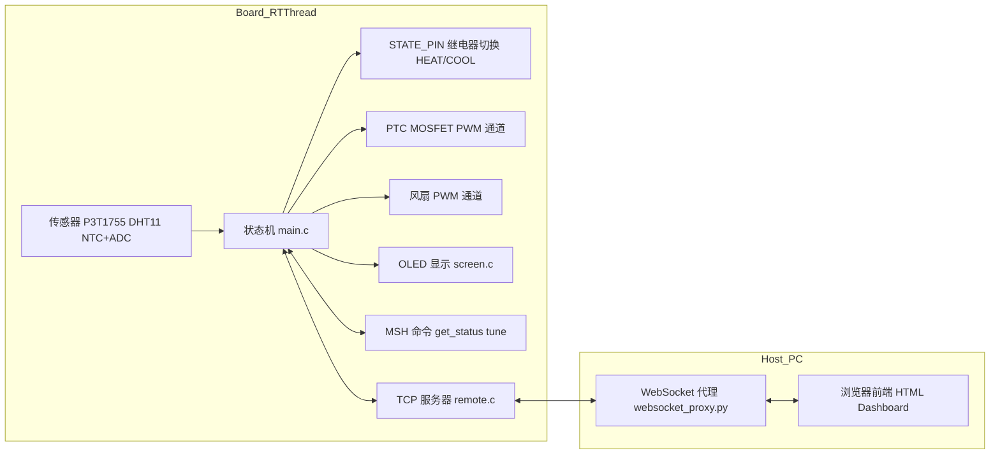

# 基于 RT-Thread 的恒温泡沫箱

本项目是一个基于 RT-Thread 和 NXP FDRM‑MCXA156 的桌面温控箱系统：

- 通过 LR7843 MOSFET 对 PTC 进行 PWM 占空比控制
- 使用 NTC + ADC 实时测量 PTC 自身温度，做前馈 + PID 闭环
- 通过继电器切换 MOSFET PWM 信号到 PTC 或风扇，实现“加热 / 风冷”双模
- RT-Thread MSH 调参命令与状态查询接口  
- 通过 TCP 的远程控制协议  
- Python WebSocket 代理  
- 浏览器端可视化仪表盘与历史曲线  

---

## 功能概览

- 恒温控制  
  - 支持目标箱内温度设定，自动在加热 / 保温 / 冷却三种状态间切换  
  - 加热侧：MOSFET（LR7843）+ PTC，PWM 控制 PTC 功率，并对 PTC 温度做闭环与过温保护  
  - 冷却侧：PWM 控制风扇，实现箱体降温  
  - 使用状态继电器 `STATE_PIN` 在“制热”（PWM 到 MOS‑PTC）和“降温”（PWM 到风扇）之间切换

- 传感与显示  
  - 使用板载 P3T1755 作为环境温度传感器 `env_temperature`  
  - 使用 DHT11 获取箱内温度 `current_temperature` 与湿度 `current_humidity`  
  - 使用 NTC + ADC 测量 PTC 表面温度 `ptc_temperature`，用于加热闭环与过温保护  
  - OLED 屏幕实时显示控制状态、箱内温度、目标温度、环境温度等

[OLED](assets/OLED.jpg)

- 网络与远程控制  
  - 板端启动 TCP 服务器，提供 JSON 状态查询和参数配置接口（命令 `get_status` / `tune`）  
  - Python [`websocket_proxy.py`](applications/remote/websocket_proxy.py) 作为 WebSocket 代理，与浏览器前端通讯  
  - Web 仪表盘 [`index.html`](applications/HTML/index.html) 展示实时温度 / PTC 状态 / 控制状态 / PID 参数等，并支持在线调参

[dashboard](assets/dashboard.png)

- 调参与诊断  
  - MSH 命令：  
    - `get_status`：打印当前系统状态与 PID 内部状态  
    - `tune`：统一调参入口（目标温度、迟滞、偏置、PID 与前馈表等）  
  - TCP 协议直接透传 `tune` 命令，Web 前端可发文本命令进行调试

---

## 系统架构与数据流

### 总体架构



---

## 核心控制逻辑

### 1. 采样与状态机 [`applications/main.c`](applications/main.c)

主线程中（约 $SAMPLE\_PERIOD\_MS = 1000$ ms）：

- 采集传感器：
  - `p3t1755_read_temp(&env_temperature)` 获取环境温度
  - DHT11：
    - `dht_temp_dev` 读箱内温度 `current_temperature`
    - `dht_humi_dev` 读箱内湿度 `current_humidity`
- 基于箱内温度构造三态状态机：

  ```c
  warming_threshold = get_warming_threshold(target_temperature);
  float upper_bound = target_temperature + hysteresis_band;
  float lower_bound = target_temperature - hysteresis_band - warming_threshold;

  if (current_temperature < lower_bound)      control_state = CONTROL_STATE_HEATING;
  else if (current_temperature > upper_bound) control_state = CONTROL_STATE_COOLING;
  else                                        control_state = CONTROL_STATE_WARMING;
  ```

- 当 `control_state` 发生变化时：
  - 先关闭 PWM 输出：`rt_pwm_set(pwm_dev, 0, PTC_PERIOD, 0);`
  - 小延时确保安全
  - 根据状态切换 `STATE_PIN`：
    - `HEAT`：PWM 接到 MOS‑PTC，加热模式
    - `COOL`：PWM 接到风扇，冷却模式
  - 对应重置 PID 积分、防止跨模式积累

### 2. PID 控制线程 [`pid_entry`](applications/main.c)

独立线程（周期 $CONTROL\_PERIOD\_MS$，默认 100 ms）：

- 读取 PTC 温度：
  - `adc_dev = rt_device_find(PTC_TEMP_ADC);`
  - `adc_value = rt_adc_read(adc_dev, PTC_ADC_CHANNEL);`
  - 通过 NTC 分压计算 PTC 温度：

    ```c
    float voltage = (float)adc_val * ADC_REF_VOLTAGE / ADC_RESOLUTION;
    float r_ntc   = NTC_SERIES_R * voltage / (ADC_REF_VOLTAGE - voltage);
    float ln_r    = log(r_ntc / NTC_R25);
    float t_k     = 1.0f / ((1.0f / 298.15f) + (ln_r / NTC_B_VALUE));
    ptc_temperature = t_k - 273.15f;
    ```

- 状态依赖控制：

  - `CONTROL_STATE_HEATING`（加热阶段）
    - 目标为 PTC 目标温度：`target_temperature + heating_bias`
    - PID 控制器：`pid_heat`（三参数 PID）
    - 前馈：`get_feedforward_pwm(target_temperature + heating_bias)`  
      前馈表 `ff_table[]` 为 PTC 目标温度 → PWM 占空比
    - 对 PTC 温度做过温保护：超过 `PTC_MAX_SAFE_TEMP` 立即将输出置 0

  - `CONTROL_STATE_WARMING`（保温阶段）
    - 目标为 PTC 保温温度：`target_temperature + warming_bias`
    - 同样使用 `pid_heat` + 前馈控制，但积分限幅相对较小，以避免保温时输出抖动过大

  - `CONTROL_STATE_COOLING`（冷却阶段）
    - 控制目标为箱内温度 `current_temperature` 跟踪 `target_temperature`
    - 控制器 `pid_cool`，当前实现为 PI：
      - 输出范围映射到风扇 PWM（`fan_min` ~ `fan_max`）
    - 此时 `STATE_PIN` 已切换到 `COOL`，PWM 输出通过继电器驱动风扇

- 最终输出：
  - 所有模式下得到归一化占空比 `final_pwm_duty`（0.0~1.0）
  - 统一通过 PWM 通道输出：

    ```c
    rt_uint32_t pulse = (rt_uint32_t)(final_pwm_duty * PTC_PERIOD);
    rt_pwm_set(pwm_dev, 0, PTC_PERIOD, pulse);
    ```

---

## 硬件接口与 Kconfig 配置

### 1. 系统变量与引脚定义 [`applications/system_vars.h`](applications/system_vars.h)

- 模式切换：
  - `STATE_PIN`：0=制热（PWM 信号传递给 MOS‑PTC），1=降温（PWM 信号传递给风扇）
- PTC 相关：
  - `PTC_TEMP_ADC` / `PTC_ADC_CHANNEL`：NTC 所在 ADC 通道
  - `PTC_PERIOD = 1e9 / PKG_USING_PTC_FREQUENCY`：PWM 周期（纳秒）
  - `PTC_MAX_SAFE_TEMP`：PTC 安全最高工作温度
- NTC 参数：
  - `NTC_R25`、`NTC_B_VALUE`、`NTC_SERIES_R`、`ADC_REF_VOLTAGE`、`ADC_RESOLUTION`
- 控制周期：
  - `$SAMPLE\_PERIOD\_MS$`：主循环采样周期
  - `$CONTROL\_PERIOD\_MS$`：PID 控制周期

- PID 上下文：
  - `pid_ctx_t` 包含 $K_P, K_I, K_D$、积分、前一误差、输出限幅等
  - `pid_heat`：加热/保温 PID
  - `pid_cool`：冷却 PI

### 2. PWM 设备配置 [`applications/Kconfig`](applications/Kconfig)

- 风扇 `YS4028B12H` 相关配置（仍然存在）  
- MOS‑PTC 配置：

  - `PKG_USING_PTC_PWM_DEV_NAME`：MOS-PTC 使用的 PWM 设备名（默认 `"pwm0"`）
  - `PKG_USING_PTC_PWM_CHANNEL`：PWM 通道号（默认 1）
  - `PKG_USING_PTC_FREQUENCY`：PWM 频率（Hz），用于计算 `PTC_PERIOD`

这些配置最终由 `initialization()` 中的：

```c
pwm_dev = (rt_pwm_t)rt_device_find(PKG_USING_PTC_PWM_DEV_NAME);
rt_pwm_set(pwm_dev, 0, PTC_PERIOD, 0);
rt_pwm_enable(pwm_dev, 0);
```

绑定到实际硬件。

---

## 远程 TCP 服务与协议更新

### TCP 服务 [`applications/remote/remote.c`](applications/remote/remote.c)

- 监听端口：`SERVER_PORT = 5000`
- 命令格式：文本 + `\r\n` 结尾
- 支持命令：
  - `get_status`
    - 返回 JSON，字段：

      - `current_ptc_temperature`：PTC 温度（NTC 计算）
      - `current_temperature`：箱内温度（DHT）
      - `target_temperature`：目标箱内温度
      - `current_humidity`：箱内湿度
      - `env_temperature`：环境温度
      - `ptc_state`：`HEAT` 时 `"ON"` 否则 `"OFF"`（实质为加热/冷却模式标识）
      - `control_state`：`HEATING/WARMING/COOLING`
      - `current_pwm`：当前 PWM 占空比
      - `heat_kp/heat_ki/heat_kd`：加热 PID 参数
      - `cool_kp/cool_ki`：冷却 PI 参数
      - `warming_bias/heating_bias`：PTC 温度偏置
      - `warming_threshold/hysteresis_band`：状态机相关参数

  - `tune ...`
    - 透传到 `tune(argc, argv)`，用于统一调参（详见下一节）

---

## 调参接口

### MSH 命令 `tune` [`applications/main.c`](applications/main.c)

统一的调参入口，典型用法：

- 目标温度与状态机：
  - `tune target <val>`：设置箱内目标温度（°C）
  - `tune hys <val>`：设置迟滞带（°C）
  - `tune warmbias <val>`：保温阶段 PTC 目标偏置（°C）
  - `tune heatbias <val>`：加热阶段 PTC 目标偏置（°C）

- 前馈表：
  - `tune ff 0 <temp> <value>`：调整 PTC 前馈表中某温度点的 PWM 基值
    - 表结构在 `ff_table[]` 中，`target_temp -> base_pwm`
    - 当前只支持修改已有点（±2°C 范围），不支持新增条目（TODO）

  - `tune ff 1 <temp> <value>`：调整 `warming_ff_table[]` 中的预热阈值：
    - 影响 `warming_threshold` 插值，用于决定 HEATING → WARMING 的区间

- PID 参数：
  - 加热/保温 PID：
    - `tune heat kp <val>`
    - `tune heat ki <val>`
    - `tune heat kd <val>`
  - 冷却 PI：
    - `tune cool kp <val>`
    - `tune cool ki <val>`

- 无参数时：
  - 直接打印当前状态（等效于 `get_status` 加 PID 内部变量）

### `get_status` 输出 [`applications/main.c`](applications/main.c)

- 打印：
  - 状态机状态、箱内温度、PTC 温度、湿度、PWM 占空比、迟滞带
  - 加热 PID / 冷却 PI 的当前参数与内部积分、上一误差  
 便于线下通过串口快速调参与验证。

---

## Web/PC 侧与之前基本保持一致

- WebSocket 代理 [`applications/remote/websocket_proxy.py`](applications/remote/websocket_proxy.py)：
  - 周期性向板端 TCP 服务器发送 `get_status`，解析 JSON 后广播给所有 WebSocket 客户端
  - 客户端发送的任意命令行（如 `tune ...`）会被转发给板子

- Web 前端 [`applications/HTML/index.html`](applications/HTML/index.html)：
  - 仪表盘结构、历史 K 线等与之前一致
  - 可根据 `current_ptc_temperature` 等新字段扩展显示内容（如增加 PTC 温度曲线）

---

## 编译与运行

> 本项目使用 RT-Thread Env 的 scons 构建工程，板子选用 NXP FDRM‑MCXA156，请按自身项目实际情况调整。

### 1. 硬件与 RT-Thread 工程

- MCU 平台：参考 [`board`](board/board.c) 与 `board/MCUX_Config/board/MCXA156.mex` 中配置  
- RT-Thread 版本：`rt-thread-5.2.1`（已包含在仓库中）  
- 必要组件：
  - PIN 驱动、I2C、PWM、ADC、WDT 等驱动  
  - 网络协议栈（lwIP 等），确保 socket/TCP 可用  
  - WLAN 驱动，满足 `rt_wlan_connect` 调用  

### 2. 编译固件

- 根据已有工程文件构建：
  - VSCode 工程：`scons --target=vsc`
  - Keil 工程：`scons --target=mdk` [project.uvprojx](project.uvprojx)  
  - SCons 配置：[`applications/SConscript`](applications/SConscript:1)、[`board/SConscript`](board/SConscript:1)、[`Libraries/drivers/SConscript`](Libraries/drivers/SConscript:1)  
- 编译得到固件并烧录到目标板  

### 3. 网络配置

在 [`applications/main.c`](applications/main.c) 中：

```c
rt_wlan_connect("142A_SecurityPlus", "142a8888");
```

- 将 SSID 和密码替换为你实际的 WiFi 信息  
- 或者改为通过 MSH 命令配置 WLAN  

---

## 远程控制与可视化使用流程

1. 板子上电运行，连接到指定 WiFi，并自动启动 TCP 服务器与远程控制线程  
2. 在 PC 上启动 WebSocket 代理：  

   ```bash
   python applications/remote/websocket_proxy.py
   ```

   按实际情况修改其中的 `TCP_SERVER_IP`（板子 IP）和端口。  

3. 在 PC 上打开前端页面：  

   ```text
   applications/HTML/index.html
   ```

   页面中的脚本会连接到 `ws://<PC-IP>:8765`（可在 [`script.js`](applications/HTML/script.js) 中查看/修改）。  

4. 在浏览器中：  
   - 实时查看箱内温度、PTC 温度、控制状态、PWM 占空比等  
   - 在线发送 `tune` 命令，调整目标温度、PID 参数、前馈表、偏置和迟滞  
   - 利用历史 K 线/曲线观察温控性能和 overshoot/settling time

[history](assets/history.png)
> K线图看起来比较有意思而已，可以随便换
---

## 目录结构

- `applications/`  
  - `main.c`：主状态机、PID 线程、前馈表、初始化入口  
  - `system_vars.h`：全局变量、PID 上下文、引脚与 ADC/NTC 参数定义  
  - `Kconfig`：风扇与 MOS‑PTC PWM 设备配置  
  - `OLED/screen.c`：OLED 显示线程  
  - `remote/remote.c`：板载 TCP 服务器  
  - `remote/websocket_proxy.py`：PC 端 WebSocket 代理  
  - `HTML/`：前端仪表盘页面与脚本  
- `board/`：BSP、时钟、引脚、链接脚本等  
- `Libraries/drivers/`：外设驱动（ADC、PWM、I2C、UART 等）  
- `rt-thread-5.2.1/`：RT-Thread 内核及组件  

---

## 注意事项

- PTC 为大功率发热件，本项目因为选用110°的PTC，所以仅通过软件限制 `PTC_MAX_SAFE_TEMP`。
- NTC 参数（R25、B 值、分压电阻）请根据实际选型更新，否则 PTC 温度估算会有偏差，影响 PID 和保护
- `STATE_PIN` 接继电器逻辑必须与硬件一致：避免在 HEAT 模式下同时驱动风扇，或者产生意外短路路径
- DHT11 读取温度比较容易失败，而且数据滞后也比较严重，如果手头有更好的建议换掉
