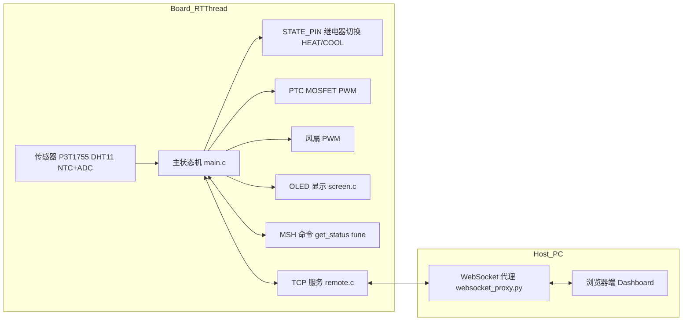
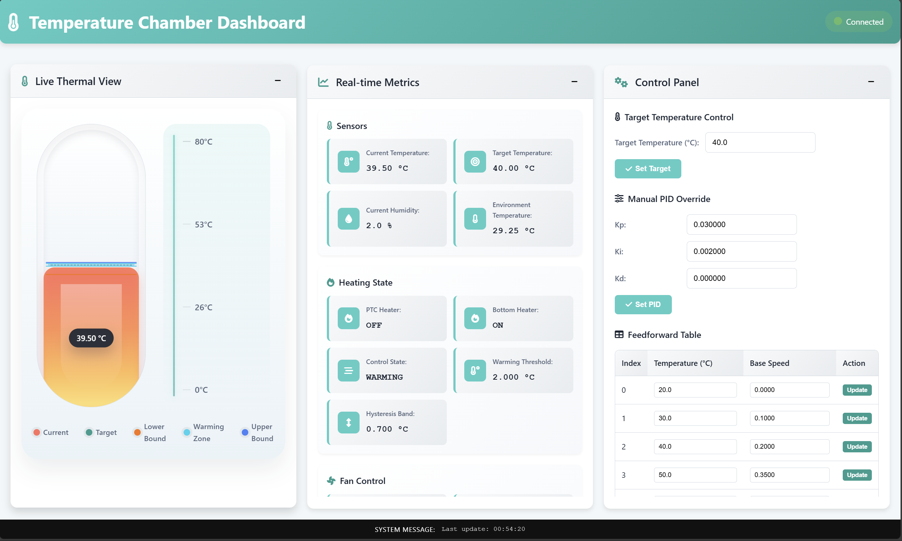
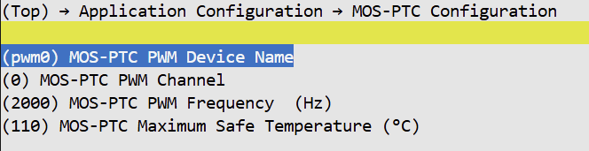
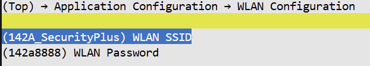

# 基于 RT-Thread 的简易恒温泡沫箱

一个基于 RT-Thread 和 NXP FDRM‑MCXA156 开发板的简单桌面温控箱系统，通过级联PID实现对泡沫箱内部温度的较精确控制，并提供远程监控和可视化界面。

## 项目亮点

- **软硬件完整闭环**  
  - LR7843 MOSFET + PTC 发热片，实现 PWM 功率控制  
  - NTC+ADC 实时测量 PTC 自身温度，做前馈 + PID 闭环并带过温保护  
  - 通过继电器切换同一路 PWM 到 PTC 或风扇，实现加热 / 风冷双模

- **多传感器融合与状态机控制**  
  - 环境温度：板载 P3T1755  
  - 箱内温湿度：DHT11  
  - PTC 表面温度：NTC+ADC  
  - 基于箱内温度构造三态状态机：加热 HEATING / 保温 WARMING / 冷却 COOLING，实现自动切换

- **远程控制 + Web 可视化**  
  - 板端 TCP 服务器，提供 JSON 状态查询与调参命令  
  - Python WebSocket 代理，桥接 TCP 与浏览器  
  - 浏览器端 Dashboard 实时显示温度、PWM、控制状态和历史曲线，并支持在线调参

- **良好的可调试性与可复用性**  
  - RT-Thread MSH 命令：`get_status` / `tune`  
  - 前馈表、PID 参数、温度偏置、迟滞等都可在运行时调整  
  - 代码结构清晰，便于在其他恒温、烘干箱、小型环境舱项目中复用

---

## 系统架构概览

### 整体架构



- **板端 RT-Thread**：负责采样、状态机、PID/前馈控制、PWM 输出和本地 OLED 显示  
- **TCP 服务**：向外暴露 JSON 状态和调参接口  
- **PC + 浏览器**：通过 Python WebSocket 代理与板子通信，实现可视化和远程控制

---

## 功能简述

### 1. 恒温控制逻辑

核心实现位于 [`applications/main.c`](applications/main.c)。

- **状态机控制**  
  - 根据箱内温度与目标温度构造三态状态机：  
    - `CONTROL_STATE_HEATING`：加热模式  
    - `CONTROL_STATE_WARMING`：保温模式  
    - `CONTROL_STATE_COOLING`：冷却模式

- **级联 PID + 前馈控制**  
  - 加热/保温阶段：  
    - 外环 `pid_box`：根据箱体温度 `current_temperature → target_temperature` 给出 PTC 目标温度  
    - 内环 `pid_ptc`：将 `ptc_temperature` 拉向外环设定的 `ptc_target_temp`  
    - 前馈表 `ff_table[]`：根据 PTC 目标温度给出一个 PWM 基准，占空比在此基础上由 PID 做收敛微调
    - PTC 过温保护：超过 `PTC_MAX_SAFE_TEMP` 立即切断输出  
  - 冷却阶段：  
    - 使用 PI 控制器 `pid_cool` 驱动风扇 PWM，使箱内温度回到目标值

- **PWM 输出统一管理**  
  - 根据不同状态得到统一的 `final_pwm_duty`（0~1），最终映射为实际 PWM 脉宽输出

### 2. 传感器与本地显示

相关定义集中在 [`applications/system_vars.h`](applications/system_vars.h)，OLED 逻辑在 [`applications/OLED/screen.c`](applications/OLED/screen.c)。

- 传感器：  
  - 环境温度：P3T1755 → `env_temperature`  
  - 箱内温湿度：DHT11 → `current_temperature / current_humidity`  
  - PTC 温度：NTC+ADC → `ptc_temperature`（通过标准 NTC 阻值–温度模型计算）
  
- OLED 显示：  
  - 显示当前控制状态、目标温度、箱内温度、环境温度、PTC 温度等关键信息  


---

## 远程控制与可视化

### 1. TCP 服务

实现在 [`applications/remote/remote.c`](applications/remote/remote.c)。

- **端口**：`5000`  
- **协议**：一行一个命令，以 `\r\n` 结束  
- **核心命令**：
  - `get_status`：返回 JSON，包含：
    - `current_ptc_temperature`、`current_temperature`、`current_humidity`、`env_temperature`  
    - `target_temperature`、`control_state`、`current_pwm`  
    - 各路 PID/PI 的参数，以及状态机相关参数（迟滞、偏置等）
  - `tune ...`：透传到板端 `tune(argc, argv)`，用于在线调参（详见下节）

### 2. WebSocket 代理与前端 Dashboard

- WebSocket 代理脚本：[`applications/remote/websocket_proxy.py`](applications/remote/websocket_proxy.py)  
  - 运行在 PC 上，与板端 TCP 服务保持连接  
  - 向浏览器暴露 WebSocket 接口（默认 `ws://<PC-IP>:8765`）

- 前端页面：[`applications/HTML/index.html`](applications/HTML/index.html) 与相关脚本（如 [`applications/HTML/script.js`](applications/HTML/script.js)）  
  - 实时仪表盘：显示箱内温度、PTC 温度、控制状态、PWM 占空比等  
  - 历史曲线：观察温度变化、超调和稳定时间  
  - 在线调参：通过发送 `tune` 文本命令直接修改 PID、前馈表、偏置和迟滞



  
> 历史曲线目前采用 K 线风格展示，仅为看着有趣，可以很容易替换为其他图表库。

---

## 调参与诊断能力

### MSH 命令接口（板端）

主要在 [`applications/main.c`](applications/main.c) 中注册：

- `tune`：统一调参命令  
  - 目标温度与状态机相关：
    - `tune target <val>`：设置目标箱内温度  
    - `tune hys <val>`：设置迟滞带  
    - `tune warmbias <val>` / `tune heatbias <val>`：保温/加热阶段的 PTC 温度偏置  
  - 前馈表：
    - `tune ff 0 <temp> <value>`：修改 `ff_table[]` 中对应温度点的基准 PWM  
    - `tune ff 1 <temp> <value>`：修改 `warming_ff_table[]` 中的预热阈值，影响 HEATING → WARMING 切换区间  
  - PID/PI 参数：
    - 箱体外环 PID：`tune box kp/ki/kd <val>`  
    - PTC 内环 PID：`tune heat kp/ki/kd <val>`  
    - 冷却 PI：`tune cool kp/ki <val>`  
  - 无参数调用时会打印当前全部参数和关键状态

- `get_status`：  
  - 在串口打印当前状态机状态、箱内/环境/PTC 温度、湿度、PWM 占空比等  
  - 同时输出各路 PID/PI 当前参数、积分项、上一误差，便于线下调试

### 远程与本地配合

- 本地：通过串口 MSH 快速试参、诊断问题  
- 远程：通过网页发送 `tune` / `get_status` 指令，在浏览器上观察实时和历史曲线，实现闭环调参

---

## 工程与使用说明

### 1. 工程与依赖

- MCU 平台：NXP FDRM‑MCXA156，对应 BSP 见RT-Thread主仓库
- RT-Thread 版本：`rt-thread-5.2.1`（已包含在仓库中）  
- 主要依赖组件：
  - PIN / I2C / PWM / ADC / WDT 等基础驱动  
  - 网络协议栈（如 lwIP），支持 socket/TCP  
  - WLAN 驱动，满足 `rt_wlan_connect` 调用

与 PWM 和 NTC/ADC 相关的系统变量在 [`applications/system_vars.h`](applications/system_vars.h) 中统一定义，例如：

- `STATE_PIN` 控制继电器：  
  - 0 = 制热（PWM → MOS‑PTC）  
  - 1 = 降温（PWM → 风扇）
- NTC 参数：`NTC_R25`、`NTC_B_VALUE`、`NTC_SERIES_R`、`ADC_REF_VOLTAGE` 等  
- 控制周期：`SAMPLE_PERIOD_MS`、`CONTROL_PERIOD_MS`  
- 各路 PID 上下文结构 `pid_ctx_t`

PWM 设备与频率等配置集中在 [`applications/Kconfig`](applications/Kconfig)，例如：

- `APP_PTC_PWM_DEV_NAME`（默认 `"pwm0"`）  
- `APP_PTC_PWM_CHANNEL`（默认 1）  
- `APP_PTC_FREQUENCY`，用于计算 `PTC_PERIOD`



### 2. 编译与烧录

本项目使用 RT-Thread Env 的 SCons 构建：

- 生成 VSCode 工程：`scons --target=vsc`
- 生成 Keil 工程：`scons --target=mdk`
- 获取软件包：`pkgs --update`
- 编译：`scons -j32`

SCons 入口脚本参考：

- [`applications/SConscript`](applications/SConscript)  
- [`board/SConscript`](board/SConscript)  
- [`Libraries/drivers/SConscript`](Libraries/drivers/SConscript)  

编译完成后按各自工具链流程烧录到 FDRM‑MCXA156 开发板。

### 3. 网络配置与运行流程

- `menuconfig->Application->WLAN`
  - `APP_WLAN_SSID`：网络名称
  - `APP_WLAN_PASSWORD`：密码

```c
rt_wlan_connect(APP_WLAN_SSID, APP_WLAN_PASSWORD);
```




1. 将 SSID 和密码修改为实际 WiFi 信息，或改为通过 MSH 配置  
2. 上电运行，等待板子连接 WiFi 并启动 TCP 服务器  
3. 在 PC 上启动 WebSocket 代理：

   ```bash
   python applications/remote/websocket_proxy.py
   ```

   根据需要修改脚本中的 `TCP_SERVER_IP`（板子 IP）和端口。

4. 在 PC 上用浏览器打开前端页面：

   ```text
   applications/HTML/index.html
   ```

   页面脚本默认连接 `ws://<PC-IP>:8765`，可在 [`applications/HTML/script.js`](applications/HTML/script.js) 中调整。

5. 在浏览器中查看实时数据、历史曲线，并通过表单或命令行输入框发送 `tune` 命令进行在线调参。

---

## 目录结构

- `applications/`  
  - `main.c`：主状态机、PID 线程、前馈表、初始化入口
  - `system_vars.h`：全局变量、PID 上下文、引脚与 ADC/NTC 参数定义
  - `Kconfig`：风扇与 MOS‑PTC PWM 设备相关配置
  - `OLED/screen.c`：OLED 显示
  - `remote/remote.c`：板端 TCP 服务器
  - `remote/websocket_proxy.py`：PC 端 WebSocket 代理
  - `HTML/`：前端仪表盘页面与脚本
- `board/`：BSP、时钟、引脚、链接脚本等
- `Libraries/drivers/`：ADC、PWM、I2C、UART 等外设驱动
- `rt-thread-5.2.1/`：RT-Thread 内核及组件源码

---

## 注意事项

- PTC 为大功率发热件：  
  - 本项目使用额定约 110°C 的 PTC，通过软件限制 `PTC_MAX_SAFE_TEMP` 实现保护，但硬件上仍需预留足够散热与安全裕度。
- NTC 参数需要与实际器件匹配：  
  - 请根据实际选型更新 `R25`、`B 值` 和分压电阻，否则 PTC 温度估算会有偏差，影响控制精度和安全。
- DHT11 精度和稳定性有限：  
  - 读数可能失败、延迟较大，如有条件建议替换为更可靠的温湿度传感器。